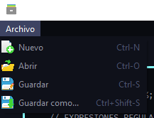
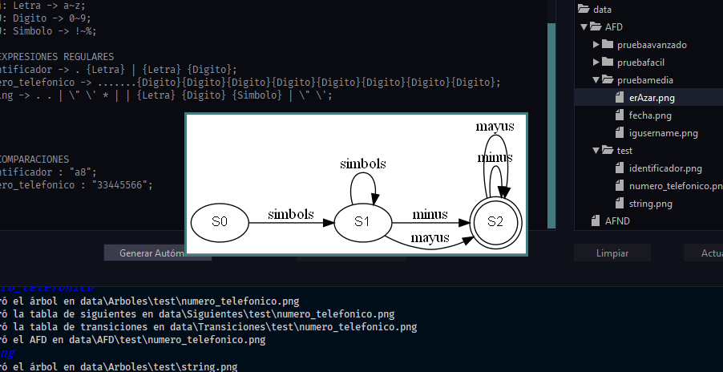

# 1. Manual de Usuario

Regexive es un software gráfico desarrollado en Java.

## 1.1. Índice

- [1. Manual de Usuario](#1-manual-de-usuario)
  - [1.1. Índice](#11-índice)
- [2. Manual de Usuario](#2-manual-de-usuario)
  - [2.1. Introduccion](#21-introduccion)
  - [2.2. Glosario](#22-glosario)
  - [2.3. Uso de Regexive](#23-uso-de-regexive)
  - [2.4. Interfaz Gráfica](#24-interfaz-gráfica)
    - [2.4.1. Editor de texto](#241-editor-de-texto)
    - [2.4.2. Árbol de directorios](#242-árbol-de-directorios)
    - [2.4.3. Terminal de salida](#243-terminal-de-salida)
    - [2.4.4. Generar autómata](#244-generar-autómata)
    - [2.4.5. Analizar entrada](#245-analizar-entrada)
    - [2.4.6. Limpiar](#246-limpiar)
    - [2.4.7. Actualizar](#247-actualizar)
    - [2.4.8. Nuevo](#248-nuevo)
    - [2.4.9. Abrir](#249-abrir)
    - [2.4.10. Guardar](#2410-guardar)
    - [2.4.11. Guardar como](#2411-guardar-como)
  - [2.5. Lenguaje OLC](#25-lenguaje-olc)
    - [2.5.1. Comentarios](#251-comentarios)
    - [2.5.2. Estructura general](#252-estructura-general)
    - [2.5.3. Definición de conjuntos](#253-definición-de-conjuntos)
    - [2.5.4. Definición de expresiones regulares](#254-definición-de-expresiones-regulares)
    - [2.5.5. Definición de una comparación](#255-definición-de-una-comparación)
    - [2.5.6. Ejemplar de un archivo OLC](#256-ejemplar-de-un-archivo-olc)
  - [2.6. Flujo de la Aplicación](#26-flujo-de-la-aplicación)

# 2. Manual de Usuario

## 2.1. Introduccion

Regexive es un software que permite al usuario la definición de patrones de cadenas mediante expresiones regulares y conjuntos, así como la evaluación de cadenas de prueba, y reportación gráfica del proceso de análisis.

## 2.2. Glosario

| Término           | Descripción                       |
| ----------------- | --------------------------------- |
| hola              | saludo                            |
| hola              | saludo                            |
| Expresión regular | Definición de patrones de cadenas |
| Cadena            | Secuencia de caracteres. Texto.   |
| AFD               | Autómata finíto determinista      |
| hola              | saludo                            |
| hola              | saludo                            |
| hola              | saludo                            |
| hola              | saludo                            |
| hola              | saludo                            |


## 2.3. Uso de Regexive

Para ejecutar Regexive es necesario tener instalado JVM. Puedes descargarlo [acá](https://www.java.com/es/download/).
Se puede abrir el ejecutable o ejecutar el siguiente comando en el mismo directorio del ejecutable:
```sh
java -jar Regexive.jar
```

## 2.4. Interfaz Gráfica


La interfaz gráfica cuenta con los siguientes elementos:

### 2.4.1. Editor de texto

Editor de entrada de texto. El texto analizado


### 2.4.2. Árbol de directorios

Visualizador del directorio de almacenamiento de reportes. Con un clic principal se pueden desplegar o contraer las carpetas, o visualizar archivos. Con un clic derecho se pueden eliminar carpetas o archivos, luego de una confirmación.

### 2.4.3. Terminal de salida

Texto de salida de la aplicación. Se generan salidas al abrir archivos, al analizar entradas, etc.

### 2.4.4. Generar autómata

Botón que genera el autómata finito determinístico (AFD) utilizando las expresiones regulares ingresadas.

### 2.4.5. Analizar entrada

Botón para analizar las comparaciones utilizando los AFD generados mediante 'Generar autómata'. Si no se han generado autómatas se pregunta si se quiere generar los autómatas.

### 2.4.6. Limpiar

Limpia la terminal de salida.

### 2.4.7. Actualizar

Actualiza el árbol de directorios.



### 2.4.8. Nuevo

Genera un nuevo archivo .olc en el editor de texto. Si no se ha guardado el archivo actual se pregunta si se desea guardar el archivo. Crear un nuevo archivo elimina los autómatas generados.

### 2.4.9. Abrir

Abre un archivo seleccionado mediante una ventana de selección. Si no se ha guardado el archivo actual se pregunta si se desea guardar el archivo. Abrir un archivo elimina los autómatas generados.

### 2.4.10. Guardar

Guarda el texto del editor de texto en el archivo abierto. Si se trata de un archivo nuevo se abre una ventana para guardar el archivo.

### 2.4.11. Guardar como

Guarda el texto del editor de texto en un archivo nuevo o existete, seleccionado mediante una ventana.

## 2.5. Lenguaje OLC

Este lenguaje permite la creación de conjuntos, la definición de expresiones regulares básicas y la evaluación de cadenas.

### 2.5.1. Comentarios

Se pueden escribir comentarios de una línea o comentarios multilínea de la siguiente manera:

```sh
 //   Comentario de una linea 
 
 <!
      Comentario multilínea
                                !>
 ```

### 2.5.2. Estructura general

La estructura general de un archivo .olc se divide en dos partes, separadas por cuatro '%', de la siguiente manera:

```sh
{

    <!
          Definición de conjuntos y expresiones regulares
    !>

  %%
  %%

    <!
          Definición de conjuntos y comparaciones
    !>

}
 ```

 ### 2.5.3. Definición de conjuntos

 Los conjuntos se pueden definir en cualquier parte del documento. La definición de un conjunto se realiza mediante la palabra reservada 'CONJ':

 ```sh
{

    CONJ: <identificador> -> <definición>;

                      .
                      .
                      .

}
 ```

- El identificador de un conjunto debe empezar con una letra, y luego puede continuar con letras, dígitos o barras bajar '_'.

- Un conjunto puede definir un rango de caracteres (letras, dígitos, símbolos) o caracteres separados por coma.

 ```sh
 CONJ: id -> <caracter>, <caracter>, . . . ;
 ```

 ```sh
 CONJ: id -> <caracter>~<caracter>;
 ```

El caracter puede ser cualquier letra minúscula o mayúscula, un dígito o un símbolo teniendo en cuenta que en el alfabeto ASCII se definen los tipos de menor a mayor: 
    
 ```sh
    <minúsculas> - <mayúsculas> - <números>
 ```

 Ejemplos:
  
 ```sh
{

    CONJ: numero -> 0~9;
    CONJ: interrogacion -> ?, ¿; 
    CONJ: mi_conjunto -> 1, b, c, a, 2, 3, &, (;

                      .
                      .
                      .

}
 ```


 ### 2.5.4. Definición de expresiones regulares

La definición de una expresión regular únicamente se puede hacer antes de los cuatro '%'. Para la definicón de una expresión regular se utiliza la notación polaca (prefija). Las operaciones admitidas son:

 |      Operación      | Forma  |    Significado     |
 | :-----------------: | :----: | :----------------: |
 |    Concatenación    | . a b  |   a seguido de b   |
 |     Disyunción      | \| a b |       a o b        |
 | Cerradura de Kleene |  * a   | cero o más veces a |
 | Cerradura positiva  |  + a   | una o más veces a  |
 | Cerradura booleana  |  ? a   |  cero o una vez a  |
 
Donde a, b, etc. es un caracter denotado por sí mismo, un conjunto previamente definido denotado con {identificador}, una cadena denotada con "cadena", o un caracter especial (\n, \\', \\"). Se admite cualquier combinación de estas operaciones. Por ejemplo:

  ```sh
    . a * | b ? c
 ```

 

 Para definir una expresión regular se hace de la siguiente manera:

  ```sh
<identificador> -> <definición>
 ```

 El identificador de la expresion regular debe cumplir las reglas de identificadores, mientras que la definición de la expresión regular es cualquier expresión regular en notación polaca

 Ejemplos:
  
 ```sh
{

    CONJ: numero -> 0~9;

    expresion1 -> . a | b c
    numero_real -> . + {numero} . "." * {numero};

                      .
                      .
                      .

}
 ```

### 2.5.5. Definición de una comparación

Las comparaciones se realizan únicamente después de los cuatro '%'. La estructura de una comparación es la siguiente:

  ```sh
    <expresion_regular> : <cadena>;
 ```

De lado izquierdo se escribe el identificador de una expresión regular previamente definida, con la que se desea comparar la cadena. La cadena se escribe entre comillas dobles ".

Ejemplos:
  
 ```sh
{
                      .
                      .
                      .

    numero_real:"87.6788";
    mi_cadena:"abccac";

}
 ```


 ### 2.5.6. Ejemplar de un archivo OLC

 ```sh
{
    // CONJUNTOS
    conj: Letra -> a~z;  	
    CONJ: Digito -> 0~9;
    CONJ: Simbolo -> !~%;

    // EXPRESIONES REGULARES
    identificador -> . {Letra} | {Letra} {Digito};
    numero_telefonico -> .......{Digito}{Digito}{Digito}{Digito}{Digito}{Digito}{Digito}{Digito};
    string -> . . | \" \' * | | {Letra} {Digito} {Simbolo} | \" \';
    
%%
%%

	// COMPARACIONES
    identificador : "a8";
    numero_telefonico : "33445566";

}
 ```


## 2.6. Flujo de la Aplicación

Para empezar a trabajar con un archivo OLC se puede crear uno desde cero, o abrir uno existente desde el menú.

La aplicación utilizará el texto en el editor para análisis, por lo que debemos cumplir con la definición del lenguaje OLC anterior descrita.

Para generar los autómatas finitos determinísticos se debe presionar el botón 'Generar Autómatas', que procederá a realizar un análisis léxico y semántico de la entrada, validando la correcta escritura y estructura del texto ingresado mediante analizadores.

La aplicación generará todos los reportes dentro de una carpeta *data* en el directorio de la aplicación. Los reportes se pueden visualizar mediante el árbol de directorios, y se puede visualizar la imagen al presionar esta en el árbol.



Para analizar las comparaciones se debe presionar el botón 'Analizar Entrada', que procederá a analizar la cadena de entrada con el AFD de la expresión especificada.

Si la cadena es capaz de llegar a un estado final a partir de transiciones en el AFD entonces la cadena será válida; de lo contrario la cadena no es válida con esa expresión regular.


